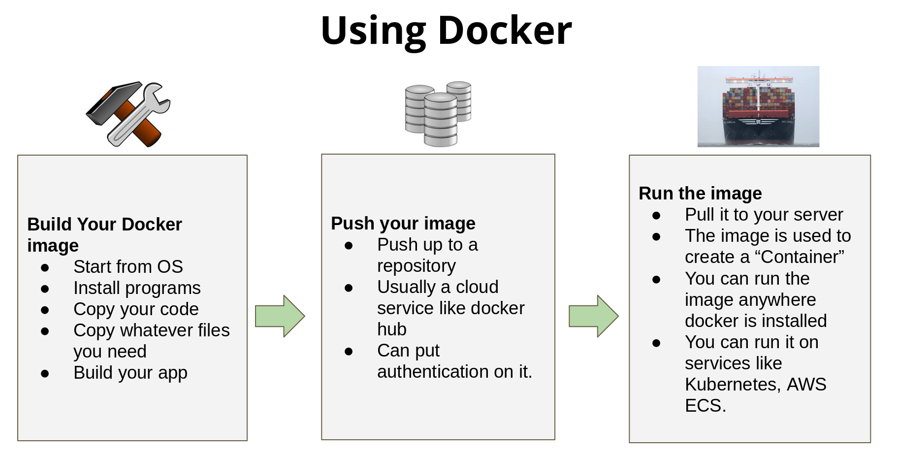
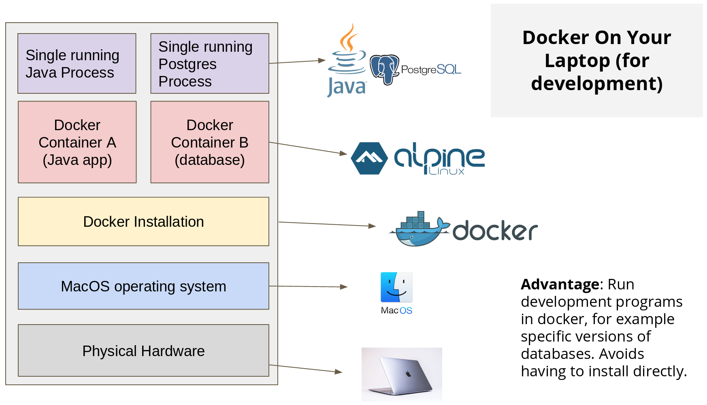

# Docker Session - Step-by-Step Setup Guide

## 📖 Quick Reference

**What is Docker Compose?**
- A tool to run multiple Docker containers together
- Instead of running each container separately, you define everything in one file
- One command starts all services: `docker-compose up`

**Why Dockerfile?**
- Builds your custom application image
- Defines how to set up your Node.js app
- Like a recipe for creating your app container

**Why docker-compose.yml?**
- Orchestrates multiple services (MongoDB, Redis, your app)
- Defines how they connect and communicate
- Like a conductor's score for an orchestra

**The Flow:**
1. Dockerfile → Builds your app image
2. docker-compose.yml → Runs all services together
3. docker-compose up → Starts everything!

---

## 📋 Prerequisites

Before you begin, make sure you have the following installed on your system:

- **Docker** (version 20.10 or higher)
- **Docker Compose** (version 2.0 or higher)
- **Node.js** (optional, for local development - version 18 or higher)

### Checking Your Installation

Open your terminal and run:

```bash
docker --version
docker-compose --version
```

If these commands work, you're ready to proceed!

---

## 📚 Understanding Docker Basics (For Beginners)

### What is Docker?

Think of Docker like a **shipping container** for software. Just like how shipping containers can carry any cargo and work on any ship, Docker containers can run any application and work on any computer that has Docker installed.


**Key Concepts:**
- **Image**: A blueprint or template (like a recipe)
- **Container**: A running instance of an image (like a cake made from the recipe)
- **Dockerfile**: Instructions to build an image
- **Docker Compose**: A tool to manage multiple containers together



### What is Docker Compose?

**Docker Compose** is a tool that helps you run **multiple Docker containers** together easily. Instead of running each container separately with long commands, you write a simple configuration file (`docker-compose.yml`) and Docker Compose handles everything.

**Real-world analogy:**
- Without Docker Compose: You have to manually start your database, then your cache, then your app, and connect them all
- With Docker Compose: You write a recipe once, and it starts everything in the right order automatically

**Why use Docker Compose?**
1. **Simplicity**: One command (`docker-compose up`) starts everything
2. **Orchestration**: It manages multiple services together
3. **Networking**: It automatically creates a network so containers can talk to each other
4. **Configuration**: All settings in one file, easy to understand and modify

---

## 📄 Understanding the Files

### Why Do We Need a Dockerfile?

**Dockerfile** is like a **recipe** that tells Docker:
- What base image to use (like choosing an operating system)
- What files to copy
- What commands to run
- How to start the application

**Why we need it:**
- Without Dockerfile: You'd have to manually install Node.js, copy files, install dependencies on every machine
- With Dockerfile: Docker automatically does all of this consistently every time

**Think of it like this:**
- Your code: "I need Node.js 18, these packages, and run this command"
- Dockerfile: "Here's how to set that up step by step"
- Docker: "I'll create a container with exactly that setup"



### Why Do We Need docker-compose.yml?

**docker-compose.yml** is like a **conductor's score** for an orchestra. It tells Docker:
- Which services (containers) to run
- How they should be configured
- How they should connect to each other
- What ports to expose
- Where to store data

**Why we need it:**
- **Without docker-compose.yml**: You'd need to run 3 separate commands:
  ```bash
  docker run mongodb ...
  docker run redis ...
  docker run app ...
  ```
  And manually connect them!

- **With docker-compose.yml**: One command starts everything:
  ```bash
  docker-compose up
  ```

**Key Benefits:**
1. **One file, all services**: Everything is defined in one place
2. **Automatic networking**: Services can find each other by name
3. **Dependency management**: Ensures services start in the right order
4. **Easy sharing**: Anyone can run your entire setup with one command

---


## 🔍 Line-by-Line Explanation: Dockerfile

Let's understand every line in the `Dockerfile`:

```dockerfile
FROM node:18-alpine
```
**What it does:** Starts with a base image that has Node.js version 18 installed
- `node:18` = Node.js version 18
- `alpine` = A very small Linux distribution (makes the image smaller)
- **Think of it as:** "Start with a computer that has Node.js already installed"

```dockerfile
WORKDIR /app
```
**What it does:** Sets `/app` as the working directory inside the container
- All commands will run from this directory
- **Think of it as:** "Go to the /app folder and work from there"

```dockerfile
COPY package*.json ./
```
**What it does:** Copies `package.json` and `package-lock.json` to the container
- We copy package files first (before copying all code)
- **Why?** Docker caches layers. If package.json doesn't change, Docker won't reinstall dependencies
- **Think of it as:** "Copy the shopping list first"

```dockerfile
RUN npm install
```
**What it does:** Installs all Node.js dependencies listed in package.json
- This happens inside the container
- **Think of it as:** "Buy all the items from the shopping list"

```dockerfile
COPY . .
```
**What it does:** Copies all remaining files from your project to the container
- First `.` = current directory on your computer
- Second `.` = current directory in container (which is `/app`)
- **Think of it as:** "Copy all your code files"

```dockerfile
EXPOSE 3000
```
**What it does:** Documents that the app will use port 3000
- This doesn't actually open the port, it's just documentation
- The actual port mapping happens in docker-compose.yml
- **Think of it as:** "This app needs port 3000 to work"

```dockerfile
CMD ["npm", "start"]
```
**What it does:** Defines the command to run when the container starts
- This runs `npm start` which executes `node server.js`
- **Think of it as:** "When you start this container, run this command"

---

## 🔍 Line-by-Line Explanation: docker-compose.yml

Let's understand every line in the `docker-compose.yml` file:

### File Header

```yaml
version: '3.8'
```
**What it does:** Specifies the Docker Compose file format version
- Different versions support different features
- Version 3.8 is widely supported and stable
- **Think of it as:** "Use this version of the recipe format"

### Services Section

```yaml
services:
```
**What it does:** Starts the list of services (containers) to run
- Everything under this is a service that will become a container
- **Think of it as:** "Here are all the applications I want to run"

---

### MongoDB Service

```yaml
  # MongoDB Service
  mongodb:
```
**What it does:** Defines a service named "mongodb"
- The name "mongodb" is how other services will find it
- **Think of it as:** "I want a MongoDB database, and I'll call it 'mongodb'"

```yaml
    image: mongo:7.0
```
**What it does:** Uses the official MongoDB image version 7.0
- Docker will download this image from Docker Hub if not already present
- **Think of it as:** "Use the MongoDB 7.0 template"

```yaml
    container_name: docker-session-mongodb
```
**What it does:** Gives the container a specific name
- Makes it easier to identify in `docker ps`
- **Think of it as:** "Name this container 'docker-session-mongodb'"

```yaml
    restart: unless-stopped
```
**What it does:** Automatically restarts the container if it crashes
- `unless-stopped` = restart always, unless you manually stop it
- **Think of it as:** "If MongoDB crashes, start it again automatically"

```yaml
    ports:
      - "27017:27017"
```
**What it does:** Maps port 27017 from container to your computer
- Format: `"host_port:container_port"`
- Left side (27017) = port on your computer
- Right side (27017) = port inside the container
- **Think of it as:** "Make MongoDB accessible on port 27017 of my computer"

```yaml
    environment:
      MONGO_INITDB_DATABASE: testdb
```
**What it does:** Sets environment variables inside the container
- Creates a database named "testdb" when MongoDB first starts
- **Think of it as:** "When MongoDB starts, create a database called 'testdb'"

```yaml
    volumes:
      - mongodb_data:/data/db
```
**What it does:** Stores MongoDB data in a Docker volume
- `mongodb_data` = name of the volume (defined later)
- `/data/db` = where MongoDB stores data inside the container
- **Why?** Data persists even if you delete the container
- **Think of it as:** "Save MongoDB data in a safe place that won't be deleted"

```yaml
    networks:
      - app-network
```
**What it does:** Connects MongoDB to a Docker network
- Allows other services on the same network to find it
- **Think of it as:** "Put MongoDB on the 'app-network' so other apps can find it"

---

### Redis Service

```yaml
  # Redis Service
  redis:
```
**What it does:** Defines a service named "redis"
- **Think of it as:** "I want a Redis cache, and I'll call it 'redis'"

```yaml
    image: redis:7-alpine
```
**What it does:** Uses Redis version 7 with Alpine Linux (smaller image)
- **Think of it as:** "Use the Redis 7 template (lightweight version)"

```yaml
    container_name: docker-session-redis
```
**What it does:** Names the container "docker-session-redis"
- **Think of it as:** "Name this container 'docker-session-redis'"

```yaml
    restart: unless-stopped
```
**What it does:** Auto-restarts Redis if it crashes
- **Think of it as:** "If Redis crashes, start it again automatically"

```yaml
    ports:
      - "6379:6379"
```
**What it does:** Makes Redis accessible on port 6379
- **Think of it as:** "Make Redis accessible on port 6379 of my computer"

```yaml
    volumes:
      - redis_data:/data
```
**What it does:** Stores Redis data in a volume
- **Think of it as:** "Save Redis data in a safe place"

```yaml
    networks:
      - app-network
```
**What it does:** Connects Redis to the app-network
- **Think of it as:** "Put Redis on the 'app-network'"

---

### Node.js Application Service

```yaml
  # Node.js Application
  app:
```
**What it does:** Defines a service named "app" for our Node.js application
- **Think of it as:** "I want my Node.js app, and I'll call it 'app'"

```yaml
    build: .
```
**What it does:** Builds the image using the Dockerfile in the current directory
- The `.` means "current directory"
- Docker will look for `Dockerfile` and build it
- **Think of it as:** "Build my app using the Dockerfile recipe"

```yaml
    container_name: docker-session-app
```
**What it does:** Names the container "docker-session-app"
- **Think of it as:** "Name this container 'docker-session-app'"

```yaml
    restart: unless-stopped
```
**What it does:** Auto-restarts the app if it crashes
- **Think of it as:** "If my app crashes, start it again automatically"

```yaml
    ports:
      - "3000:3000"
```
**What it does:** Makes the app accessible on port 3000
- **Think of it as:** "Make my app accessible on port 3000 of my computer"

```yaml
    environment:
      PORT: 3000
      MONGODB_URI: mongodb://mongodb:27017
      REDIS_HOST: redis
      REDIS_PORT: 6379
```
**What it does:** Sets environment variables for the Node.js app
- `PORT: 3000` = App runs on port 3000
- `MONGODB_URI: mongodb://mongodb:27017` = Connect to MongoDB using service name "mongodb"
  - **Important:** We use "mongodb" (service name), not "localhost"!
- `REDIS_HOST: redis` = Connect to Redis using service name "redis"
- `REDIS_PORT: 6379` = Redis port
- **Think of it as:** "Tell my app where to find MongoDB and Redis"

```yaml
    depends_on:
      - mongodb
      - redis
```
**What it does:** Ensures MongoDB and Redis start BEFORE the app
- Docker Compose will start mongodb and redis first, then the app
- **Why?** The app needs them to be running to connect
- **Think of it as:** "Wait for MongoDB and Redis to be ready before starting my app"

```yaml
    networks:
      - app-network
```
**What it does:** Connects the app to the app-network
- This allows the app to communicate with mongodb and redis
- **Think of it as:** "Put my app on the 'app-network' so it can talk to MongoDB and Redis"

```yaml
    volumes:
      - .:/app
      - /app/node_modules
```
**What it does:** Mounts your code directory into the container
- `.:/app` = Mount current directory to `/app` in container
  - Changes to your code are immediately reflected (useful for development)
- `/app/node_modules` = Anonymous volume to prevent overwriting node_modules
  - Keeps the container's node_modules separate from your local one
- **Think of it as:** "Sync my code files, but keep node_modules separate"

---

### Volumes Section

```yaml
# Volumes for data persistence
volumes:
  mongodb_data:
  redis_data:
```
**What it does:** Defines named volumes for data storage
- `mongodb_data` = Volume for MongoDB data
- `redis_data` = Volume for Redis data
- These volumes persist even if containers are deleted
- **Think of it as:** "Create storage spaces that won't be deleted"

---

### Networks Section

```yaml
# Network for service communication
networks:
  app-network:
    driver: bridge
```
**What it does:** Creates a Docker network named "app-network"
- `bridge` = The default network driver (allows containers to communicate)
- All services on this network can find each other by service name
- **Think of it as:** "Create a private network where all my services can talk to each other"

---

## 🔗 How Dockerfile and docker-compose.yml Work Together

### The Relationship

**Dockerfile:**
- Builds the **image** for your Node.js application
- Defines: "What should be inside my app container?"
- Used by: `docker build` command (or `docker-compose build`)

**docker-compose.yml:**
- Uses the **image** (built from Dockerfile) to create a **container**
- Also pulls ready-made images (MongoDB, Redis) from Docker Hub
- Defines: "How should all containers work together?"
- Used by: `docker-compose up` command

### Visual Flow

```
1. Dockerfile
   ↓
   Builds Node.js app image
   ↓
2. docker-compose.yml
   ↓
   Pulls MongoDB image (from Docker Hub)
   Pulls Redis image (from Docker Hub)
   Uses Node.js app image (from Dockerfile)
   ↓
3. docker-compose up
   ↓
   Creates 3 containers:
   - mongodb container (from mongo:7.0 image)
   - redis container (from redis:7-alpine image)
   - app container (from your Dockerfile image)
   ↓
   Connects them on app-network
   Starts them in the right order
```

### Why Both Are Needed

**Scenario 1: Only Dockerfile**
- You could build and run your app
- But you'd have to manually:
  - Start MongoDB separately
  - Start Redis separately
  - Connect them manually
  - Manage networking yourself

**Scenario 2: Only docker-compose.yml (without Dockerfile)**
- You could run MongoDB and Redis
- But you couldn't build your custom Node.js app
- You'd need to manually create the app image first

**Scenario 3: Both (What we have)**
- Dockerfile builds your custom app
- docker-compose.yml orchestrates everything
- One command (`docker-compose up`) does it all!

### Real-World Analogy

- **Dockerfile** = Recipe for making a cake (your app)
- **docker-compose.yml** = Menu for a complete meal (app + database + cache)
- **docker-compose up** = Order the complete meal (everything arrives together, ready to eat)

### Comparison Table

| Aspect | Dockerfile | docker-compose.yml |
|--------|------------|-------------------|
| **Purpose** | Build ONE image | Run MULTIPLE containers |
| **What it creates** | Image (blueprint) | Containers (running instances) |
| **Used for** | Your custom application | All services (app + databases) |
| **Command** | `docker build` | `docker-compose up` |
| **Contains** | Build instructions | Service definitions |
| **Can use pre-built images?** | No (builds from scratch) | Yes (can pull from Docker Hub) |
| **Networking** | Not defined here | Defines networks |
| **Dependencies** | Not managed | Manages service dependencies |

---

## 🎯 Key Takeaways

1. **Dockerfile** = Recipe to build ONE application image
2. **docker-compose.yml** = Recipe to run MULTIPLE containers together
3. **Service names** = How containers find each other (not localhost!)
4. **Volumes** = Persistent storage that survives container deletion
5. **Networks** = Private communication channel between containers
6. **Ports** = How you access containers from your computer
7. **Dockerfile builds** → **docker-compose.yml runs** → **Everything works together!**

---

## 🚀 Step-by-Step Instructions

### Step 1: Navigate to the Project Directory

Open your terminal and navigate to the project folder:

```bash
cd /home/sparkout/Documents/Docker-session
```

### Step 2: Verify Project Files

Make sure you have the following files in your directory:

- `package.json` - Node.js dependencies
- `server.js` - Main application file
- `Dockerfile` - Instructions for building the Node.js app
- `docker-compose.yml` - Configuration for all services (MongoDB, Redis, and Node app)
- `.dockerignore` - Files to exclude from Docker build

You can verify by running:

```bash
ls -la
```

### Step 3: Build and Start All Services

This is the main command that will:
- Build the Node.js application Docker image
- Start all three services together
Run this command:

```bash
docker compose up --build
```

**What happens:**
- Docker will download the MongoDB and Redis images (first time only)
- Docker will build your Node.js application
- All three containers will start and connect to each other

**Expected output:**
You should see logs from all three services:
- MongoDB starting up
- Redis starting up
- Node.js app connecting to both services

### Step 4: Verify Services Are Running

Open a **new terminal window** (keep the first one running) and check running containers:

```bash
docker ps
```

You should see three containers:
- `docker-session-mongodb`
- `docker-session-redis`
- `docker-session-app`

### Step 5: Test the Application

The application is now running on `http://localhost:3000`

#### Test 1: Health Check

```bash
curl http://localhost:3000/health
```

Expected response:
```json
{
  "status": "OK",
  "message": "Server is running",
  "timestamp": "2024-..."
}
```

#### Test 2: Create a User (MongoDB)

```bash
curl -X POST http://localhost:3000/api/users \
  -H "Content-Type: application/json" \
  -d '{"name": "John Doe", "email": "john@example.com"}'
```

Expected response:
```json
{
  "message": "User created successfully",
  "userId": "..."
}
```

#### Test 3: Get All Users (MongoDB)

```bash
curl http://localhost:3000/api/users
```

Expected response:
```json
{
  "count": 1,
  "users": [...]
}
```

#### Test 4: Store Data in Redis

```bash
curl -X POST http://localhost:3000/api/cache \
  -H "Content-Type: application/json" \
  -d '{"key": "greeting", "value": "Hello Docker!"}'
```

Expected response:
```json
{
  "message": "Value cached successfully",
  "key": "greeting",
  "value": "Hello Docker!"
}
```

#### Test 5: Retrieve Data from Redis

```bash
curl http://localhost:3000/api/cache/greeting
```

Expected response:
```json
{
  "key": "greeting",
  "value": "Hello Docker!"
}
```

#### Test 6: Get All Cache Keys (Redis)

```bash
curl http://localhost:3000/api/cache
```

---

## 🛠️ Common Commands

### Stop All Services

Press `Ctrl + C` in the terminal where `docker-compose up` is running, or run:

```bash
docker compose down
```

### Stop and Remove Volumes (Clean Slate)

This will remove all data stored in MongoDB and Redis:

```bash
docker compose down -v
```

### View Logs

View logs from all services:

```bash
docker compose logs
```

Or using the older syntax:

```bash
docker-compose logs
```

If you need sudo permissions:

```bash
sudo docker-compose logs
```

#### Follow Logs in Real-Time (Live Streaming)

View logs and follow them in real-time (like `tail -f`):

```bash
# Follow logs from all services
docker compose logs -f

# Follow logs from a specific service (app)
docker compose logs -f app

# Using docker-compose syntax
docker-compose logs -f app

# With sudo if needed
sudo docker-compose logs -f app
```

**What `-f` does:**
- Shows existing logs and continues to stream new log entries in real-time
- Press `Ctrl + C` to stop following

#### View Logs from Specific Services

```bash
# View app logs
docker compose logs app

# View MongoDB logs
docker compose logs mongodb

# View Redis logs
docker compose logs redis

# Follow app logs in real-time
docker compose logs -f app

# Follow multiple services
docker compose logs -f app mongodb
```

#### View Last N Lines of Logs

View only the last N lines of logs:

```bash
# View last 50 lines from app
docker compose logs --tail 50 app

# View last 100 lines and follow
docker compose logs --tail 100 -f app
```

#### View Logs with Timestamps

Show timestamps for each log line:

```bash
# View logs with timestamps
docker compose logs -t app

# Follow logs with timestamps
docker compose logs -t -f app
```

#### View Logs Since a Specific Time

View logs since a specific time:

```bash
# View logs since last 10 minutes
docker compose logs --since 10m app

# View logs since last hour
docker compose logs --since 1h app

# View logs since a specific time
docker compose logs --since 2024-01-01T00:00:00 app
```

### Restart a Specific Service

```bash
docker compose restart app
```

### Run in Detached Mode (Background)

Start services in the background:

```bash
docker compose up -d
```

Stop services running in background:

```bash
docker compose down
```

### Accessing Containers (Exec into Containers)

You can access the inside of a running container to run commands, check versions, debug issues, or inspect the environment.

#### Access the App Container

Enter the app container using an interactive shell:

```bash
docker compose exec app sh
```

Or using the container name directly:

```bash
docker exec -it docker-session-app sh
```

**Note:** We use `sh` instead of `bash` because the Alpine Linux image uses `sh` as its shell.

#### Check Node Version Inside App Container

Once inside the container, you can check the Node.js version:

```bash
# First, enter the container
docker compose exec app sh

# Then inside the container, run:
node --version
# or
node -v
```

Or run it directly without entering the container:

```bash
docker compose exec app node --version
```

#### Run Commands Inside the App Container

You can run any command inside the container without entering it interactively:

```bash
# Check Node version
docker compose exec app node --version

# Check npm version
docker compose exec app npm --version

# List files in the app directory
docker compose exec app ls -la

# Check environment variables
docker compose exec app env

# View package.json
docker compose exec app cat package.json

# Install a new package (if needed)
docker compose exec app npm install <package-name>

# Run a script from package.json
docker compose exec app npm run <script-name>
```

#### Access Other Containers

You can also access MongoDB and Redis containers:

```bash
# Access MongoDB container
docker compose exec mongodb sh

# Access Redis container
docker compose exec redis sh
```

#### Useful Commands Inside Containers

Once inside a container, you can use standard Linux commands:

```bash
# Check current directory
pwd

# List files
ls -la

# Check running processes
ps aux

# Check network connections
netstat -an

# Exit the container
exit
```

### Docker Image Management Commands

These commands help you manage Docker images on your system - viewing, deleting, and cleaning up unused images.

#### List All Images

View all Docker images on your system:

```bash
docker images
```

Or with more details:

```bash
docker images -a
```

#### List Images Used by This Project

View images specifically used by your docker-compose setup:

```bash
docker compose images
```

#### Delete a Specific Image

Remove a specific image by its name or ID:

```bash
# Delete by image name
docker rmi <image-name>

# Delete by image ID
docker rmi <image-id>

# Force delete (if image is in use)
docker rmi -f <image-name>
```

**Example:**
```bash
# Delete the app image (you'll need to rebuild it)
docker rmi docker-session-app

# Or delete by ID (get ID from 'docker images')
docker rmi abc123def456
```

#### Delete Multiple Images

Delete multiple images at once:

```bash
# Delete multiple images by name
docker rmi image1 image2 image3

# Delete images matching a pattern
docker images | grep docker-session | awk '{print $3}' | xargs docker rmi
```

#### Remove All Unused Images

Remove all images that are not currently used by any container:

```bash
docker image prune
```

To remove all unused images without confirmation prompt:

```bash
docker image prune -a -f
```

**What it does:**
- `-a` = Remove all unused images, not just dangling ones
- `-f` = Force removal without confirmation

#### Remove All Images (Dangerous!)

⚠️ **Warning:** This will delete ALL images on your system, including base images!

```bash
# Remove all images (requires confirmation)
docker rmi $(docker images -q)

# Force remove all images without confirmation
docker rmi -f $(docker images -q)
```

#### Docker System Prune (Complete Cleanup)

Remove all unused containers, networks, images, and build cache:

```bash
# Remove all unused resources (safe, asks for confirmation)
docker system prune

# Remove all unused resources including images
docker system prune -a

# Remove everything including volumes (⚠️ removes data!)
docker system prune -a --volumes

# Force remove without confirmation
docker system prune -a -f
```

**What each command does:**
- `docker system prune` - Removes stopped containers, unused networks, dangling images
- `docker system prune -a` - Also removes all unused images (not just dangling)
- `docker system prune -a --volumes` - Also removes unused volumes (⚠️ deletes data!)
- `-f` flag - Forces removal without asking for confirmation

#### Remove Images by Repository

Remove all images from a specific repository:

```bash
# Remove all images with a specific tag pattern
docker images | grep docker-session | awk '{print $3}' | xargs docker rmi -f
```

#### Check Image Disk Usage

See how much disk space Docker is using:

```bash
# Show disk usage for images
docker system df

# Show detailed disk usage
docker system df -v
```

#### Remove Dangling Images

Remove images that are not tagged (dangling images):

```bash
docker image prune
```

Or force remove without confirmation:

```bash
docker image prune -f
```

#### Complete Cleanup for This Project

To completely clean up this project (containers, images, volumes, networks):

```bash
# Stop and remove containers, networks, and volumes
docker compose down -v

# Remove the project's images
docker compose down --rmi all

# Or combine both
docker compose down -v --rmi all
```

**What each flag does:**
- `-v` = Remove volumes (deletes MongoDB and Redis data)
- `--rmi all` = Remove all images used by services
- `--rmi local` = Remove only images that don't have a custom tag

---

## 📁 Project Structure Explained

```
Docker-session/
├── server.js              # Main Node.js application
├── package.json           # Node.js dependencies
├── Dockerfile             # Instructions to build Node.js app image
├── docker-compose.yml     # Orchestration file for all services
├── .dockerignore          # Files to exclude from Docker build
└── SETUP_GUIDE.md         # This file
```

### What Each File Does:

1. **server.js**: 
   - Express.js server with REST API endpoints
   - Connects to MongoDB and Redis
   - Provides endpoints to interact with both databases

2. **package.json**: 
   - Lists all Node.js dependencies (express, mongodb, redis)
   - Defines start scripts

3. **Dockerfile**: 
   - Instructions for Docker to build the Node.js application
   - Uses Node.js 18 Alpine (lightweight Linux image)
   - Installs dependencies and runs the app

4. **docker-compose.yml**: 
   - Defines three services: MongoDB, Redis, and Node app
   - Sets up networking so services can communicate
   - Creates volumes for data persistence
   - Maps ports so you can access services from your host machine

---

## 🔍 Understanding Docker Concepts

### Containers
Each service (MongoDB, Redis, Node app) runs in its own container - an isolated environment.

### Networks
All containers are on the same network (`app-network`), so they can communicate using service names:
- Node app connects to MongoDB using `mongodb:27017`
- Node app connects to Redis using `redis:6379`

### Volumes
Data is stored in Docker volumes so it persists even if containers are stopped:
- `mongodb_data`: Stores MongoDB database files
- `redis_data`: Stores Redis data

### Port Mapping
- `3000:3000` - Maps container port 3000 to host port 3000
- `27017:27017` - MongoDB port
- `6379:6379` - Redis port

---

## 🐛 Troubleshooting

### Issue: Port Already in Use

If you get an error about ports being in use:

```bash
# Check what's using the port
sudo lsof -i :3000
sudo lsof -i :27017
sudo lsof -i :6379

# Or change ports in docker-compose.yml
```

### Issue: Containers Won't Start

```bash
# Check logs
docker compose logs

# Rebuild from scratch
docker compose down -v
docker compose up --build
```

### Issue: Connection Errors

Make sure all services are running:

```bash
docker ps
```

If a service is not running, check its logs:

```bash
docker compose logs [service-name]
```

### Issue: Cannot Connect to MongoDB/Redis

The services need a few seconds to start. Wait 10-15 seconds after starting and try again.

---

## 🎓 Learning Points

1. **Service Discovery**: Containers find each other by service name (not `localhost`)
2. **Dependencies**: The `depends_on` ensures MongoDB and Redis start before the app
3. **Environment Variables**: Used to configure connections between services
4. **Data Persistence**: Volumes ensure data survives container restarts
5. **Networking**: All services communicate on a private Docker network

---

## 📚 Next Steps

- Modify `server.js` to add more endpoints
- Add authentication to the API
- Implement more complex database operations
- Add error handling and validation
- Explore Docker volumes and data management
- Learn about Docker networking in detail

---

<!-- ## ✅ Summary

You've successfully:
- ✅ Set up a multi-container Docker application
- ✅ Connected Node.js to MongoDB
- ✅ Connected Node.js to Redis
- ✅ Created a RESTful API
- ✅ Learned Docker Compose basics

**Congratulations!** 🎉 You now have a working Docker setup with Node.js, MongoDB, and Redis!
 -->
